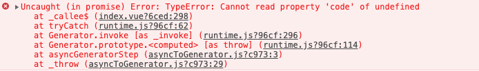

# axios 问题总结

## 问题描述

使用`axios`拦截请求和响应数据时，在`Vuex`的`action`中做异步处理，`await` 后边的请求直接报错被`catch`，而且报错信息不友好


## 错误分析

- 先从代码入手，仔细检查了请求封装和异步处理的代码，并没有发现语法和拼写错误
- 打断点走一遍逻辑，请求开始，接口没有问题，返回正常，拦截请求部分没有异常， `return`了接口返回的数据，断点走到 `await` 处进 `error`，错误信息如图
- 考虑到同样的方法之前使用并没问题，对比之前项目发现，唯一的不同是接口返回的数据结构，决定 `Mock` 数据定位问题

## Mock 数据

`before`

```json
/* {...} */

{
  "code": "00000",
  "data": {
    "access_token": "e9b67d875061fe7c71c4f15e4267947d",
    "role_name": "高级管理员",
    "role_code": "SUPER_MAN"
  },
  "message": "OK"
}
```

`after`

```json
/* { xxxx: {...} } */

{
  "xxxx": {
    "code": "00000",
    "data": {
      "access_token": "e9b67d875061fe7c71c4f15e4267947d",
      "role_name": "高级管理员",
      "role_code": "SUPER_MAN"
    },
    "message": "OK"
  }
}
```

修改后的数据结构测试通过 :tada:

::: warning 总结
使用 axios 拦截请求和响应时，返回的数据`格式`必须是以上这种:point_up_2:，可以跟后台沟通从接口返回，也可以前端手动处理
:::
