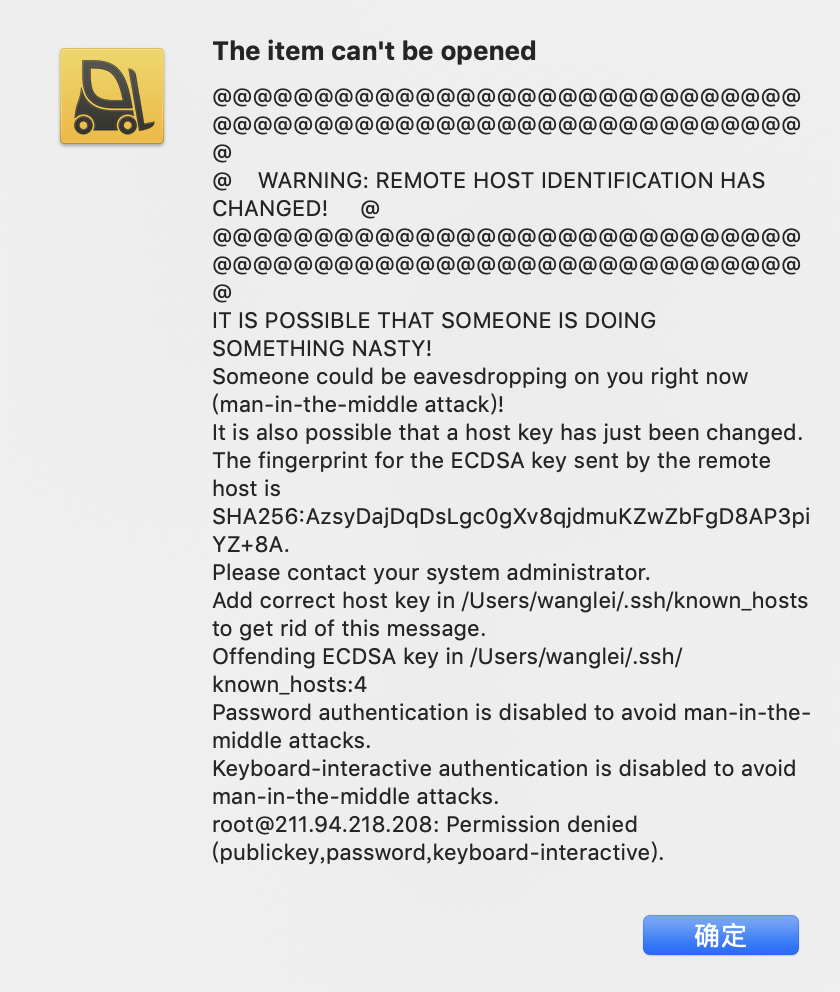
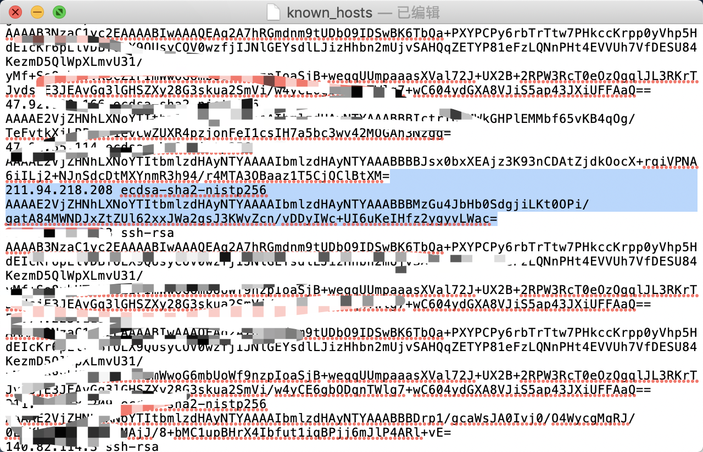

# Mac和Linux远程连接服务器异常

## 错误原因
之前用ForkLift连接服务器一直没有问题，今天报错  
`WARNING: REMOTE HOST IDENTIFICATION HAS CHANGED!)`，  
查看了配置也没有问题，错误如下

## 解决方法

看报错日志可知，由于远程的ECDSA key和本地的不匹配导致的，在本地 `/Users/<username>/.ssh/known_host` 找到known_host文件，  
找到不匹配的部分删掉重新连接就可以了

